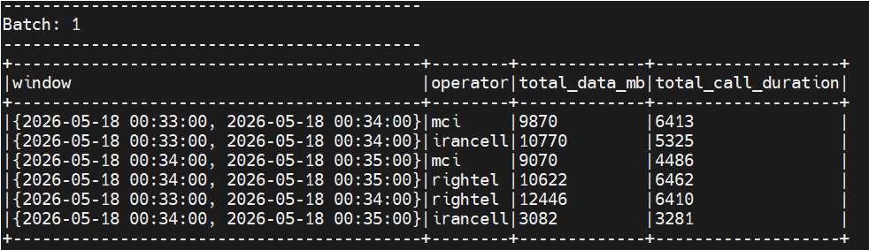
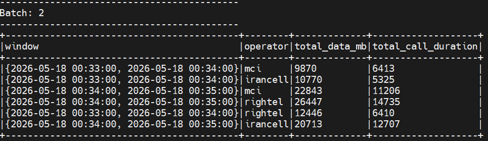
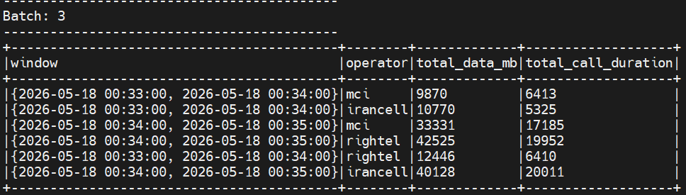

# Real-Time Telecom Streaming Pipeline (Kafka + Spark)

## Status
This project is **under development (PoC / experimental)** and not production-ready.  
Future work includes PostgreSQL storage and Grafana dashboard.

---

## Architecture

Python Producer → Kafka → Spark Streaming → Console Output
↓
(Next: PostgreSQL + Grafana)

---

## Stack

- Apache Kafka (stream ingestion)
- Apache Spark Structured Streaming (processing)
- Python (event generator)
- Docker (containerized environment)
- PostgreSQL + Grafana (planned)

---

## Data Model

Each event contains:

- user_id
- timestamp
- data_mb
- call_duration
- operator (mci / irancell / rightel)

---

## Spark Processing

- Reads from Kafka topic: `telecom_events`
- Parses JSON stream
- Window aggregation (1 minute)
- Group by operator
- Metrics:
  - total_data_mb
  - total_call_duration

---

## Run

### 1. Start environment
```
docker-compose up -d
```
### 2. Run producer
```
python3 kafka_producer.py
```
### 3. Run Spark Job
```
docker exec -it spark bash

/opt/spark/bin/spark-submit \
--master local[*] \
--packages org.apache.spark:spark-sql-kafka-0-10_2.12:3.5.1 \
/opt/spark/work-dir/spark_streaming.py
```
## Sample Terminal Output of Spark Streaming:



